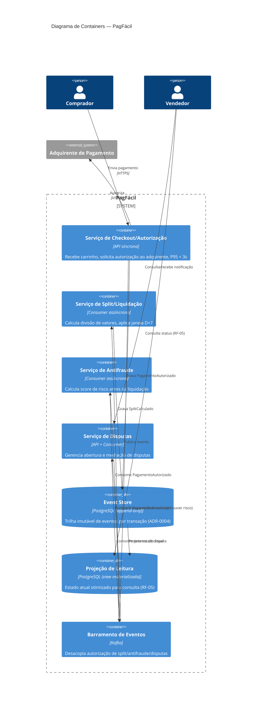

# Diagrama de Containers (C4 — Nível 2)

Detalha os serviços internos do PagFácil, decompostos conforme [ADR-0001](../03-decisoes-arquiteturais/0001-microsservicos-por-fronteira-de-negocio.md), e como se comunicam entre si — síncrono no caminho crítico, assíncrono (via eventos) em todo o resto, conforme [ADR-0003](../03-decisoes-arquiteturais/0003-processamento-assincrono-do-split.md).

**Leitura:** note que **nenhum serviço fala diretamente com outro** fora do caminho de autorização — tudo passa pelo barramento de eventos. Essa é a materialização direta da Saga coreografada definida no [ADR-0002](../03-decisoes-arquiteturais/0002-padrao-saga-para-consistencia-transacional.md): cada serviço reage a eventos, sem um orquestrador central.
