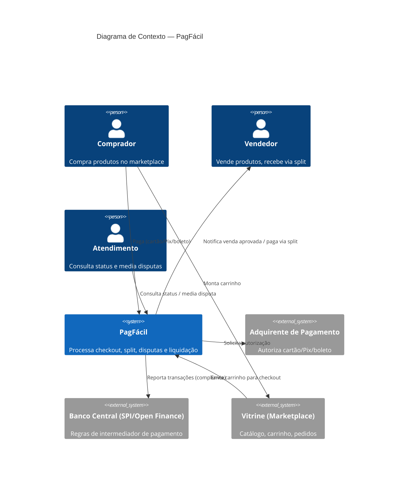

# Diagrama de Contexto (C4 — Nível 1)

Mostra o sistema PagFácil como uma caixa única e seus relacionamentos com atores e sistemas externos. Não há detalhe interno aqui de propósito — o objetivo é alinhar com stakeholders de negócio sobre "quem fala com o quê".

**Leitura:** o marketplace (Vitrine) permanece responsável pelo catálogo e carrinho — o PagFácil entra apenas a partir do checkout. Essa fronteira foi definida no discovery ([contexto-negocio.md](../01-discovery/contexto-negocio.md)) e evita que o sistema de pagamentos vire, sem necessidade, dono de dados de catálogo.
