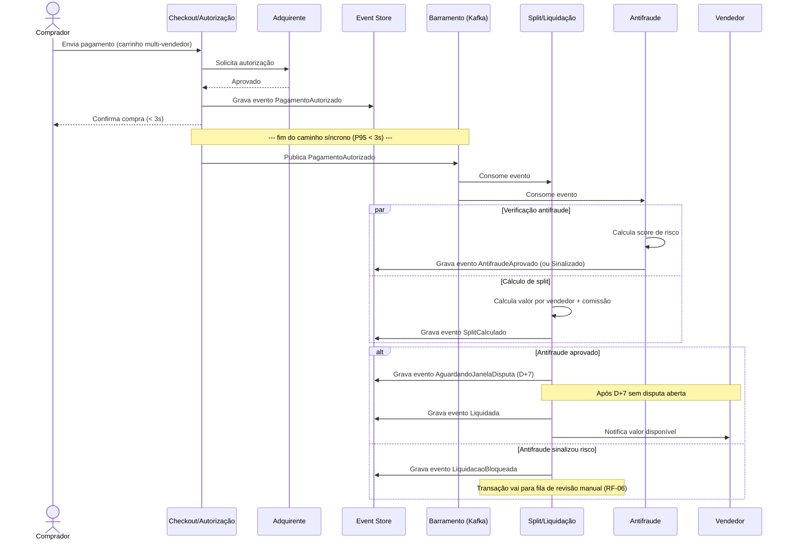

# Diagrama de Sequência — Checkout até Liquidação

Este diagrama é o que melhor mostra, na prática, a fronteira entre síncrono e assíncrono definida no [ADR-0003](../03-decisoes-arquiteturais/0003-processamento-assincrono-do-split.md): tudo acima da linha pontilhada acontece no orçamento de 3s do comprador; tudo abaixo acontece em até 5 minutos, sem que o comprador espere por isso.

**Pontos de decisão visíveis neste diagrama:**
- A resposta ao comprador (`CK-->>C`) acontece **antes** de qualquer split ou antifraude ser calculado — é o que garante o P95 < 3s sem depender da latência de serviços downstream.
- O `Event Store` é escrito por múltiplos serviços de forma independente — cada um contribui com seu próprio evento para a mesma transação, sem um coordenador central bloqueando os outros (Saga coreografada, [ADR-0002](../03-decisoes-arquiteturais/0002-padrao-saga-para-consistencia-transacional.md)).
- O branch `alt` mostra o ponto exato onde RF-06 (antifraude pré-liquidação) intercepta o fluxo antes de qualquer valor ser efetivamente liberado ao vendedor.
